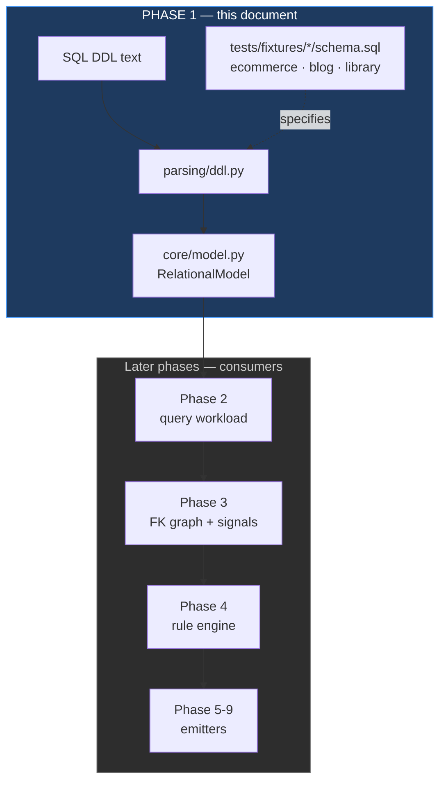
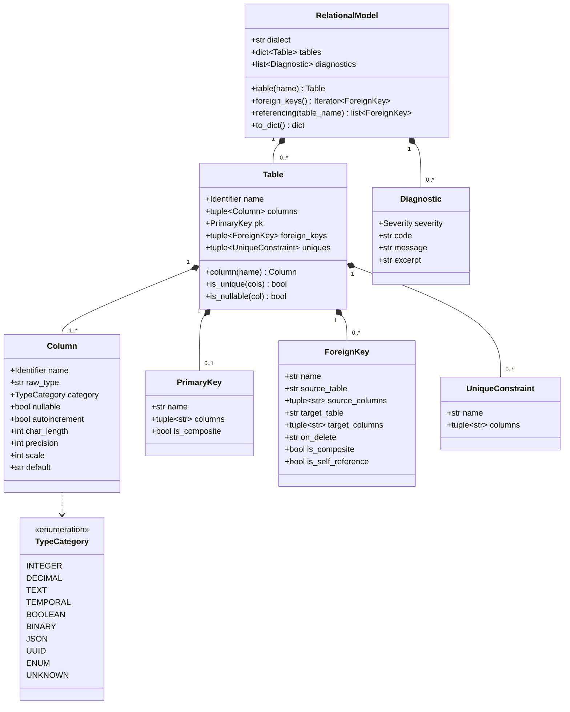
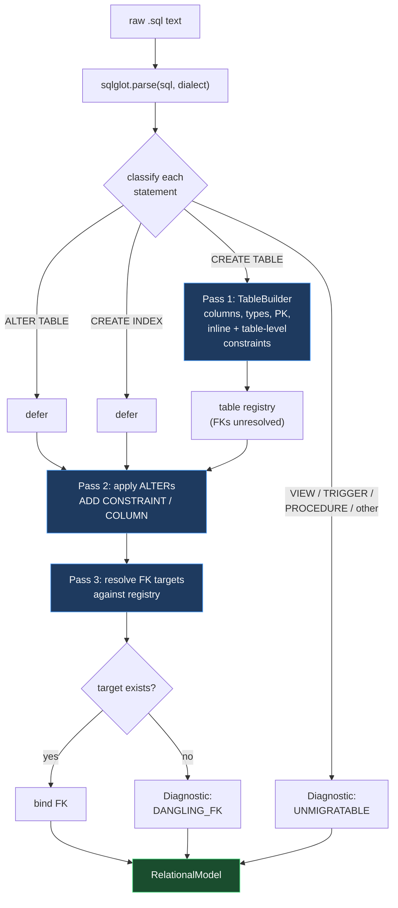

# Phase 1 — Core Model & DDL Parser: Implementation Plan

**Goal:** turn raw SQL DDL into a `RelationalModel` that every later phase reads from.
**Scope:** the model dataclasses, the sqlglot-backed parser, three test fixtures, and their tests.
**Explicitly not in scope:** query parsing, the FK graph, signals, rules, emitters.

---

## 1. Why this phase carries the most risk

Phase 1 produces the data structure the other ten phases consume. Two consequences:

- **Cardinality inference lives or dies here.** Phase 3 decides 1:1 vs 1:N by asking "is this foreign
  key column unique?" If the model can't answer that reliably — because a `UNIQUE` constraint was
  declared table-level instead of inline, or the key is composite — every downstream decision is
  wrong, silently and plausibly.
- **Golden files pin the model's shape.** From phase 4 onward, tests serialize decisions to JSON and
  diff them. Reshaping the model after that means rewriting every golden file, which destroys their
  value as a regression signal.

So the model needs to be right, or at least cheap to change, *before* phase 4 locks it down.

---

## 2. Where the phase-1 slice sits

Phase 1 has no upstream dependency and four downstream ones. That asymmetry is the whole argument
for spending design effort here.

---

## 3. The core model

### Design decisions worth arguing about

**Frozen dataclasses, not Pydantic.** The core model gets no dependency on the web layer. Pydantic
appears only in `api/schemas.py` at the HTTP boundary. This keeps the core importable and testable
without FastAPI installed, and keeps validation concerns out of the domain objects.

**Foreign keys hold table *names*, not `Table` object references.** Object references would be more
convenient to traverse, but they create cycles that break clean serialization — and phase 4's golden
files depend on serializing the model deterministically. Resolution helpers on `RelationalModel`
(`referencing()`, `table()`) give the convenience back without the cycle.

**Every key is a tuple.** `PrimaryKey.columns` and `ForeignKey.source_columns` are tuples even when
they hold one element. Composite keys are not an edge case here — junction-table detection in phase 3
is defined as "primary key is exactly two foreign key columns," which is unreachable if the model
flattens composites to scalars.

**`Table.is_unique(cols)` is the single most important method in the phase.** It must return true
whether uniqueness came from a single-column `PRIMARY KEY`, a composite PK covering exactly those
columns, an inline `UNIQUE`, a table-level `UNIQUE (...)`, or a unique index added by `ALTER TABLE`.
All five paths converge here, and phase 3's 1:1-vs-1:N call is a single invocation of it.

**Diagnostics accumulate; they don't raise.** An unparseable statement records a `Diagnostic` and the
run continues. Phase 6 needs exactly this list to produce its "constructs you must handle in the
application layer" section, so collecting them is not just error tolerance — it's a feature being
built early.

---

## 4. The parser

`sqlglot` gives a dialect-aware AST. The work is walking it into the model, and the ordering matters
because DDL is not written in dependency order.

**Three passes, because forward references are normal.** `orders` routinely references `customers`
before `customers` is defined, and `ALTER TABLE ADD CONSTRAINT` at the end of a dump is the most
common way schemas actually arrive. Resolving foreign keys inline during pass 1 would fail on both.

**Identifier normalization is its own module.** SQL identifiers are case-insensitive unless quoted,
and quoting is dialect-specific (`` `backticks` `` in MySQL, `"double quotes"` in Postgres). Every
identifier gets stored as a canonical lowercase key for lookup plus the original spelling for output.
Getting this wrong produces the nastiest possible bug class: `Orders` and `orders` becoming two
tables, so the FK graph silently disconnects and the whole analysis quietly produces nonsense.

**Type normalization maps to `TypeCategory` while keeping `raw_type`.** Phase 3 estimates row width
from declared widths, and phase 5 needs the original type to emit meaningful BSON types. Both are
retained rather than choosing one.

**Pin the sqlglot version.** Its AST node shapes change across releases; an unpinned dependency turns
into mysterious parser breakage on an unrelated day.

---

## 5. Fixtures are the specification — write them first

Before the parser exists, the three `schema.sql` files define what it must handle. Writing them first
turns "does the parser work?" into a concrete, checkable question.

| Fixture | Models | Deliberately exercises |
|---|---|---|
| **ecommerce** | customers, addresses, orders, order_items, products, categories, product_categories, payments, order_events | Composite PK on the junction, 1:1 (`payments`), unbounded child (`order_events`), inline FKs, MySQL dialect + backtick quoting |
| **blog** | authors, posts, comments, tags, post_tags, categories | Self-referencing FK (`comments.parent_id`), pure M:N junction, nullable FK, table-level constraints, Postgres dialect |
| **library** | books, book_details, authors, book_authors, members, loans, genres, branches | **1:1 via `UNIQUE` foreign key** (the `D04` trigger), lookup tables (`genres`), `ALTER TABLE ADD CONSTRAINT`, composite FK, mixed-case quoted identifiers |

Coverage checklist across all three — every row must be hit by at least one fixture:

- [ ] Inline `REFERENCES` · table-level `FOREIGN KEY` · `ALTER TABLE ADD CONSTRAINT`
- [ ] Single-column PK · composite PK · no PK at all
- [ ] Single-column `UNIQUE` · composite `UNIQUE` · unique index via `CREATE UNIQUE INDEX`
- [ ] Nullable FK · `NOT NULL` FK · self-referencing FK · composite FK
- [ ] `ON DELETE CASCADE` / `SET NULL`
- [ ] Quoted, mixed-case, and reserved-word identifiers
- [ ] MySQL and Postgres dialects
- [ ] At least one unmigratable construct (a view or trigger) to prove diagnostics fire

The `library` fixture matters most despite looking least interesting: it is the only one that
exercises 1:1 detection through a `UNIQUE` foreign key, which is the exact signal rule `D04` fires on.

---

## 6. Build order

Bottom-up, each step independently testable:

| # | File | Why here |
|---|---|---|
| 1 | `core/identifiers.py` | Everything keys off canonical names. Twenty lines, but wrong later means a silent rewrite of every lookup. |
| 2 | `core/types.py` | `TypeCategory` enum + dialect type mapping. Pure function, trivially testable. |
| 3 | `core/diagnostics.py` | `Severity`, `Diagnostic`, codes. Needed before the parser can report anything. |
| 4 | `core/model.py` | The dataclasses above, plus `is_unique()` and the resolution helpers. |
| 5 | `tests/fixtures/*/schema.sql` | The spec. Written before the parser, not after. |
| 6 | `parsing/dialects.py` | Dialect detection and sqlglot config. |
| 7 | `parsing/ddl.py` | The three passes. The bulk of the work. |
| 8 | `tests/` | Structural assertions, the `is_unique` truth table, golden model snapshots, diagnostic cases. |
| 9 | **refactor pass** | See below. |

**Start at step 1 and stop after step 5 for a first review.** Once the fixtures and model exist, the
shape of the whole system is visible and cheap to change. After the parser is written against them,
it isn't.

---

## 7. The refactor pass (step 9)

Written into the plan as a required step rather than left to chance, because the parser is where this
codebase will first accumulate mess. Specific smells to expect and fix:

- **Duplication between inline and table-level constraint handling.** These arrive as different AST
  shapes but must produce identical model objects. The first draft will almost certainly handle them
  twice. Extract one `ConstraintCollector` both paths feed.
- **`TableBuilder` growing into a god object.** If pass 1 exceeds ~150 lines, split column extraction
  from constraint extraction.
- **Dialect conditionals scattered through the walker.** Any `if dialect == "mysql"` appearing outside
  `parsing/dialects.py` belongs inside it.
- **Assertions clustered on incidental facts.** Tests that check column counts rather than the
  relationships those columns encode will pass while the model is subtly wrong.

Exit criterion for the phase: all three fixtures parse into models whose foreign keys, primary keys,
and uniqueness answers are asserted correct — and `Table.is_unique()` has a dedicated test covering
all five ways uniqueness can be declared.

---

## 8. Open questions

Two calls I'd rather make deliberately than by accident:

1. **Should phase 1 accept a live database connection** as an alternative input to a `.sql` file?
   Reading `information_schema` would give exact types and constraints, plus real row counts that
   would sharpen phase 3's estimates considerably. It's a genuinely better input — but it's also
   scope creep, and the tool is designed to work without a live database. Recommendation: defer, but
   keep the parser behind an interface so a second input source can be added without touching the model.

2. **How strict on unparseable input?** Current plan is maximally permissive: record a diagnostic,
   keep going, produce a partial model. The alternative — fail fast on any statement we don't
   understand — surfaces problems sooner but makes the tool useless against real production dumps,
   which are full of vendor-specific syntax. Recommendation: stay permissive, but surface the
   diagnostic count prominently so a half-parsed schema is never mistaken for a clean one.
