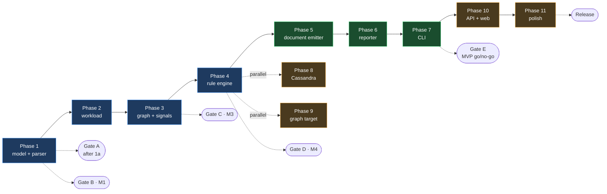
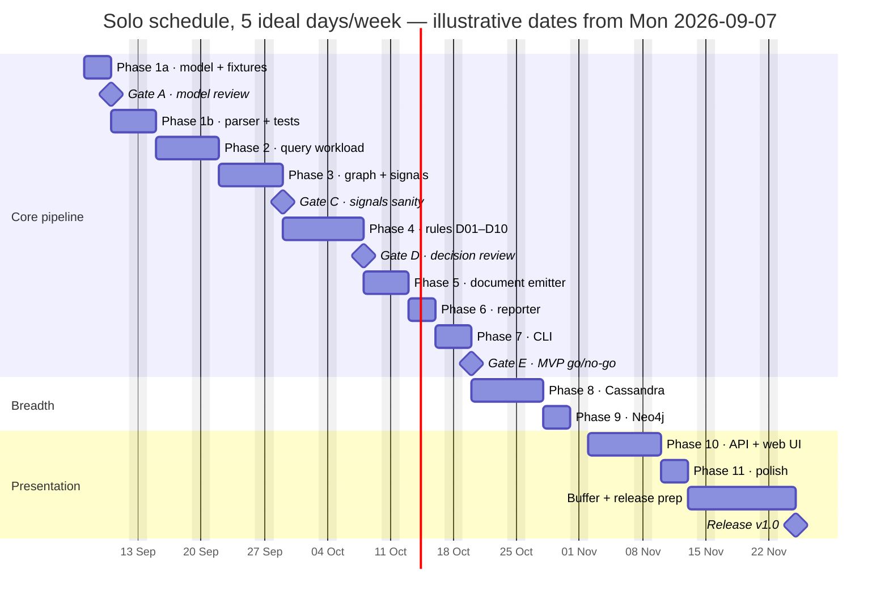

# Execution Roadmap — Relational → NoSQL Schema Migration Tool

**Companion to:** `PLAN.md` (what & why) · `docs/phase-1-plan.md` (how, phase 1)
**This document:** sequencing, effort, PR breakdown, review gates, risks, and the de-scope ladder — the when and in-what-order.

---

## 1. Assumptions and units

- **One developer, full-time-ish.** Estimates are in **ideal days (ID)** — one uninterrupted focused day. Calendar reality at ~5 ID/week. If a second developer joins, see §11.
- **Capacity-based, not date-based.** Dates below are illustrative, anchored to a Mon **2026-09-07** start. Slippage is answered by cutting scope rungs (§9), never by cutting test gates (§6).
- **Stack is fixed** by `PLAN.md`: Python 3.11+, sqlglot (pinned), FastAPI, rule-based engine. No live database.
- **The repo's own convention continues:** each phase *opens* by drafting `docs/phase-N-plan.md` (as phase 1 did) and *closes* by satisfying its milestone gate. Fixtures are the spec — every new capability starts as a fixture or a fixture extension.

---

## 2. The critical path — and where it stops being one

Phases 1–4 are **strictly sequential**: each consumes the previous phase's output. After phase 4 the graph fans out.

Two sequencing decisions worth stating out loud:

**The MVP lands before breadth.** Phases 8–10 *could* start after phase 4 (the `Decision` shape is their only interface), but in a solo schedule they run *after* phase 7 deliberately: Gate E is the scheduled moment where scope gets cut on purpose instead of by overrun. Landing the end-to-end CLI first means that cut is an option at all.

**A debug report is pulled into phase 4.** Decisions are unreviewable as raw objects. Phase 4 exits with a crude JSON dump of every decision; phase 6 turns that into the real narrative. Without this, Gate D (the decision review) can't happen.

---

## 3. Milestones

Each milestone is a demo line — something you can show and defend.

| # | Milestone | Phases | You can demo… | Exit gate |
|---|---|---|---|---|
| **M1** | It understands the schema | 1 | Paste a dump → tables, PKs, FKs, uniqueness all correct; diagnostics fire on the view/trigger | **B** |
| **M2** | It understands the workload | 2 | Load `queries.sql` → weighted access patterns: joins, filters, projections, sorts | — |
| **M3** | It knows what the schema *means* | 3 | FK graph, cardinality classes, table roles, the full signal set per fixture | **C** |
| **M4** | It makes defensible decisions | 4 | Every FK edge labeled EMBED/REFERENCE/… with rule id, signals, confidence | **D** |
| **M5** | The tool works end-to-end (MVP) | 5–7 | `nosqlmigrate analyze schema.sql --queries q.sql -o out/` → validators, CQL-free document artifacts, trade-off report | **E** |
| **M6** | Three targets | 8–9 | Same input → CQL and Cypher alongside the MongoDB output, with their own warnings | — |
| **M7** | It's presentable | 10 | Paste DDL in a browser → ER graph, target tabs, expandable rationale cards, artifact download | — |
| **M8** | Ship it | 11 | README with 60-second demo, sample-schema loader, rule-catalog page, release tag | **F** |

---

## 4. Effort estimates

| Phase | Scope summary | Opt | Likely | Pess | Cumulative (likely) |
|---|---|---|---|---|---|
| 1 | core model, sqlglot parser, 3 fixtures, full test suite, refactor pass | 4 | 6 | 9 | 6 |
| 2 | workload extraction from SELECT/INSERT/UPDATE/DELETE | 3 | 5 | 7 | 11 |
| 3 | FK graph, cardinality inference, roles, signal set | 3 | 5 | 7 | 16 |
| 4 | rule engine, `D01`–`D10`, golden decision files, debug dump | 5 | 7 | 10 | 23 |
| 5 | document emitter: collections, `$jsonSchema`, examples, indexes | 2 | 3 | 5 | 26 |
| 6 | trade-off reporter: markdown + JSON | 2 | 3 | 4 | 29 |
| 7 | CLI, end-to-end on all fixtures | 1 | 2 | 3 | 31 |
| | **MVP subtotal** | **20** | **31** | **45** | ≈ week 6 |
| 8 | column-family rules, query-first tables, CQL, hotspot warnings | 4 | 6 | 9 | 37 |
| 9 | graph rules, Cypher constraints, property placement | 2 | 3 | 5 | 40 |
| 10 | FastAPI `/api/analyze` + SPA + ER graph | 4 | 6 | 9 | 46 |
| 11 | rule catalog page, "why not?", sample loader, README | 2 | 3 | 5 | 49 |
| | **Buffer (~20%)** | | **10** | | **59** |

**Where the variance lives:** phase 1's pessimism is sqlglot dialect surprises; phase 4's is rule tuning (the intellectual core — the single most likely place to over-spend); phase 10's is UI polish, which is unbounded by nature and must be timeboxed.

**Total: ~49 ID likely, ~59 with buffer → ~12 weeks. MVP: ~31 ID → ~6–7 weeks.**

---

## 5. Schedule

Anchors: **MVP (Gate E) ≈ Oct 20, 2026. Release ≈ Nov 24, 2026.** Re-baseline at every gate; the dates after each gate are only as good as the last re-estimate.

---

## 6. Review gates

Gates are cheap meetings with yourself (or a reviewer). Each has a hard checklist.

- **Gate A — model & fixtures review** (end of phase 1a; the checkpoint `phase-1-plan.md` §6 already calls for). Model dataclasses + all three `schema.sql` files exist, parser doesn't yet. Question: *is anything missing from the model that the fixtures demand?* Changing the model now costs an afternoon; after S4's golden files it costs a regeneration cycle and a written justification.
- **Gate B — phase 1 exit.** `Table.is_unique()` passes its truth table across all five declaration paths; every fixture's FKs/PKs asserted correct; diagnostics fire on the unmigratable construct. From here, model shape changes require a PR that regenerates golden files and *explains the semantic change in the body*.
- **Gate C — signals sanity.** Walk the e-commerce signals by hand: does `co_access` for orders↔order_items dominate? Does `write_ratio` for order_events look high? Fix wrong signals *before* rules consume them — a wrong signal becomes a confidently-wrong decision, which is the failure mode this tool exists to prevent.
- **Gate D — decision review.** For every decision on every fixture: which rule fired, which signals drove it, what confidence? Any rule that never fires is dead weight; any rule that always fires is a hardcoded answer. Freeze the `Decision` schema here — emitters and the web UI build against it.
- **Gate E — MVP go/no-go.** CLI runs all three fixtures end-to-end. Now choose a rung on the de-scope ladder (§9) based on actual velocity to date. This is the planned, deliberate scope-cut moment.
- **Gate F — release.** §10 checklist.

---

## 7. PR breakdown

Small, reviewable slices; main stays green. Sizes: S ≤ 1 ID, M = 2–3 ID, L = 4+ ID.

| Slice | Branch | Contents | Phase | Size | Gate |
|---|---|---|---|---|---|
| S0 | `feat/scaffolding` | `pyproject.toml` (pinned sqlglot), ruff, pytest, CI workflow, package skeleton, `--help` stub | — | S | |
| S1 | `feat/phase-1-model` | `identifiers`, `types`, `diagnostics`, `model` + unit tests (steps 1–4) | 1 | M | |
| S2 | `feat/phase-1-fixtures` | 3 × `schema.sql` + coverage checklist (step 5) | 1 | S | **A** |
| S3 | `feat/phase-1-parser` | `dialects`, `ddl.py` three passes (steps 6–7) | 1 | L | |
| S4 | `feat/phase-1-tests` | structural tests, `is_unique` truth table, golden snapshots, diagnostics tests, refactor pass (steps 8–9) | 1 | M | **B** |
| S5 | `feat/phase-2-workload` | `queries.sql` × 3, `workload.py`, `parsing/queries.py`, pattern tests | 2 | M | |
| S6 | `feat/phase-3-signals` | `graph.py`, `signals.py`, role classification, signal snapshots | 3 | M | **C** |
| S7 | `feat/phase-4-rules` | engine, catalog, `document_rules` `D01`–`D10`, golden decisions, debug JSON dump | 4 | L | **D** |
| S8 | `feat/phase-5-document-emitter` | collections, validators, example docs, index plan, self-conformance tests | 5 | M | |
| S9 | `feat/phase-6-report` | `tradeoffs.py`, templates, markdown + JSON reports | 6 | M | |
| S10 | `feat/phase-7-cli` | `analyze` command, `-o` artifacts, end-to-end fixture runs | 7 | S | **E** |
| S11 | `feat/phase-8-columnar` | columnar rules, query-first tables, CQL, hotspot/unbounded warnings | 8 | L | |
| S12 | `feat/phase-9-graph` | graph rules, Cypher constraints, property placement | 9 | M | |
| S13 | `feat/phase-10-api` | FastAPI app, `POST /api/analyze`, error handling | 10 | M | |
| S14 | `feat/phase-10-web` | SPA: editor, ER graph, target tabs, rationale cards, downloads | 10 | L | |
| S15 | `feat/phase-11-polish` | rule-catalog page, "why not?", sample loader, README | 11 | M | **F** |

Two rules of the road: **fixtures before features** (S2 lands before S3; S5's `queries.sql` lands before `workload.py` is "done") and **a PR that regenerates a golden file says so in its body and why**.

---

## 8. Risk register

| # | Risk | Lik | Imp | Early warning | Response |
|---|---|---|---|---|---|
| R1 | sqlglot AST surprises: dialect variants, quoting, vendor syntax | Med | High | S3 spike stalls > 2 days on one construct | Pinned version; permissive diagnostics (already the phase-1 stance); worst case narrow the dialect claim and say so in the README |
| R2 | Model shape churn after golden files lock | Med | High | Gate A finds a missing concept (deferred FKs, partial indexes, …) | Gate A exists precisely for this; post-S4 shape changes are allowed but expensive on purpose |
| R3 | Rule-tuning rabbit hole in phase 4 | High | Med | Fixture decisions "mostly right" for > 3 straight days | Fixtures define *correct*; timebox phase 4 at 10 ID; ship confidence scores + "why not?" instead of chasing perfect thresholds |
| R4 | Cassandra target quietly reinvents the engine | Med | Med | Columnar rules want signals the analyzer doesn't compute | Query-first tables are workload-driven, not FK-driven — if it fights the `Decision` model, emit from `Workload` directly instead of forcing it through |
| R5 | Web UI scope creep | High | Med | PR titles containing "auth", "save", "history" | The UI is stateless: paste → analyze → render. Sample loader is a static JSON file. No accounts, no persistence, ever (this release) |
| R6 | Solo schedule slip compounds silently | Med | High | Two consecutive weeks under 60% of plan | 20% buffer; re-baseline at each gate; respond with ladder rungs (§9), never by skipping test gates |

---

## 9. De-scope ladder

Decided at **Gate E**, based on measured velocity — not gradually, by dread.

1. **P0 — must ship (phases 1–7).** CLI tool, document target, trade-off report. Without this there is no product; this is the floor.
2. **P1 — should ship (phase 10, document target only).** The web UI is what makes the tool demoable to non-CLI humans. If squeezed, it renders the document target alone — the tabs architecture leaves room for the others.
3. **P2 — nice to have (phase 9, then phase 8).** Graph before Cassandra: cheaper (3 vs 6 ID) and visually stronger in a demo. Reverse the order only if the audience is Cassandra shops.
4. **Won't — this release.** Live-DB introspection (deferred per phase-1 open question 1); user-override re-runs beyond a CLI flag; dialects beyond MySQL/Postgres; anything stateful in the web UI.

`PLAN.md` §6 already says it: *ship 1–7 plus 10 for a single target rather than three shallow targets.* The ladder is that sentence made operational.

---

## 10. Release criteria (Gate F)

- [ ] All three fixtures parse → analyze → emit for every shipped target; golden files green in CI
- [ ] Every decision cites rule id, signals, gain/cost/mitigation — machine-checked by test, not by hope
- [ ] Property test holds: no input table silently vanishes from any output (embed, reference, or dropped-with-reason)
- [ ] Round-trip sanity: every input query maps to a documented retrieval path
- [ ] README: 60-second quickstart, a screenshot or GIF, known-limits section (copied from `PLAN.md` §8 — it's honest and it's good marketing)
- [ ] Rule-catalog page renders from `rules/catalog.py` — single source of truth, no hand-maintained duplicates
- [ ] CI green on main; version tag; short release notes

---

## 11. If a second developer joins

The fan-out after Gate D is the seam: **S8–S10 (document pipeline) and S11/S12 (breadth targets) are independent** given the frozen `Decision` contract. Dev A walks the critical path (5→6→7→10), dev B takes 8 and 9. The shared surface is the `Decision` JSON schema and the fixture set — both frozen at Gate D, both versioned in-repo. Everything before Gate D stays single-owner: phases 1–4 are one brain's worth of design coherence, and splitting them costs more in coordination than it saves.

---

## 12. Start here (the first two weeks, concretely)

1. **S0 scaffolding** — half a day, unblocks everything; CI green on an empty test is the point.
2. **S1 + S2** — core model and the three `schema.sql` fixtures, then stop for **Gate A**. This is the cheapest moment to be wrong about the design.
3. **S3 + S4** — parser, tests, refactor pass → **Gate B, M1 done**: *it understands the schema.*

The pattern then repeats per phase: draft `docs/phase-N-plan.md`, extend fixtures, implement, gate, re-baseline this roadmap.
